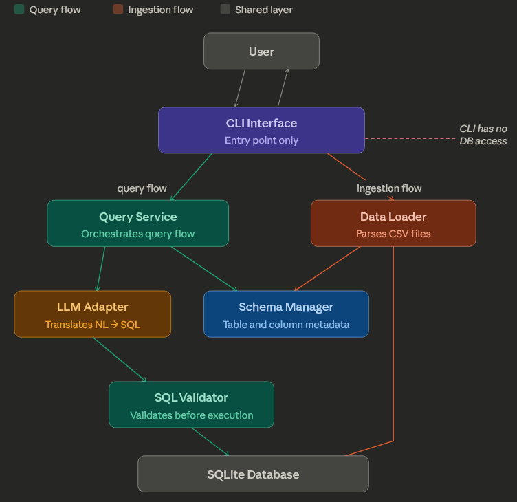

# DataSheetAI
EC530 DataSheetAI Project

Due Date: 4/5/26 (make sure to record video of project features)
Extension: 4/10/26

Objective: Design a natural language SQL query system that implements a CLI tool with two independent flows:
- Data ingestion 
- Query processing

Query Processing: 
A user can type something like "show me all customers from California" and the system:
- Sends that question to an LLM (Claude or OpenAI)
- LLM translates it to SQL
- System validates and safely executes the SQL on a SQLite database
- Returns the results to the user
 
Notes: 
- For this assignment, using Claude as Assistant/LLM Adapter 
- Recall CRUD: Create, Read, Update, Delete
- Use assistant to suggest project updates and code review
- Test data obtained from Kaggle
- Make sure to include GitHub actions

# Updated Architecture: 

# Modules: 
- cli
- data_loader
- llm_adapter
- query_service
- schema_manager
- sql_validator 

# Development Plan: 
## 0. Config + Logger
- Attempt to setup config file for best practices (helps prevent hardcoding sensitive information like API keys)
- Can be updated as each module is developed
- Setup single root logger for all modules to use to help with debugging
## 1. Data Loader
- For this project can use pandas to read CSV files but keep in mind other file types
- Confirm file type
- Verify there is data
- Clean data (data types, handle NA, etc.)
- Update schema manager and database as needed
## 2. Schema Manager / Database 
- Schema manager accessed by both query and ingestion flows
- There are several scenarios that can arise when data loader interacts with schema manager / database
- If table does not exist, create new table
- TODO: Overwrite flag from user to drop + recreate a table
- TODO: If schema match (same column + types) append rows to existing schema
## 3. Query Service
- Send query to LLM to convert to SQL
- Include instructions that prevent database updates
## 4. SQL Validator 
- How to handle SQL injections?
- Ensure LLM does not return any SQL that would alter database